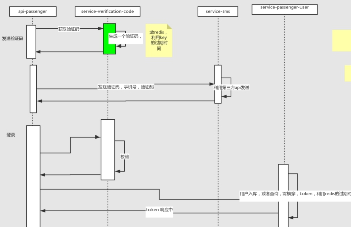
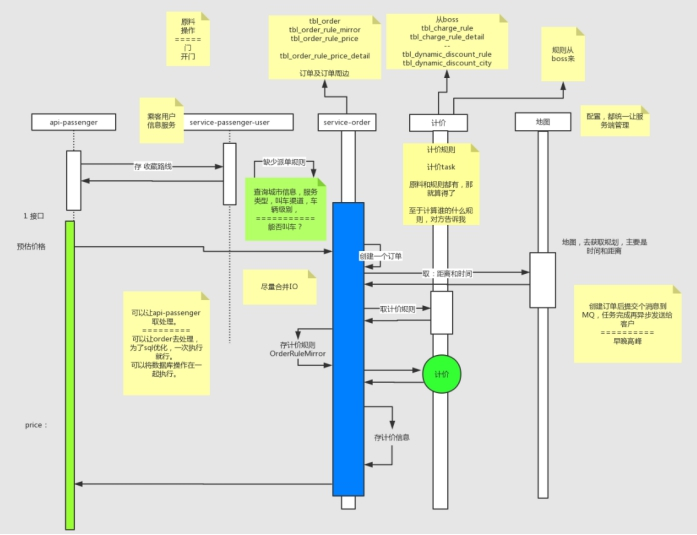
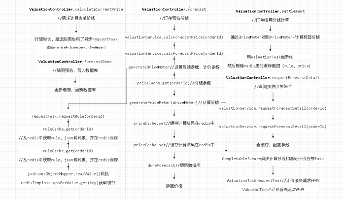

##### 项目结构划分

Bean，dto	放在二方库common中。方便互相调用

 

#### 登录

###### 业务流程图

 

Api-passenger：SmsController调用verificationCodeService来获取验证码code。采用restTemplate+拼接url

验证码服务通过身份手机号生成验证码。当然要做参数校验。然后将验证码存redis。注意最好是原子操作

调用sms服务，用的feign进行远程调用（？用来实现接口伪装）。Sms从缓存中获取短信模板，按照短信供应商的api编写即可。接着校验，再调用service-passenger-user来进行用户登录也是采用feign。然后用jwt生成token。将token返回

Feign在service中使用。不会在service中使用restTemplate+url形式。只用提供一个接口

###### 业务需求

登录限制规则

一档限制：

限制规则：1小时内非连续相同验证码错误达3次后限制10分钟后登录

注意：从第一次点击登录开始计时

对应toast提示：“您登录失败的次数过多,请 10 分钟后再重试”

二档限制：

限制规则：1小时内非连续相同验证码错误达5次后限制24小时后登录

注意：从第一次点击登录开始计时

对应toast提示：“您今天登录失败的次数过多,请 24 小时后再重试”

特殊情况（同一错误验证码限制规则）： 

限制规则：1分钟内连续相同验证码错误达3次后限制1分钟后登录

注意：从第一次点击登录开始计时

对应toast提示：“您同一个错误验证码点击登录的次数过多,请 1 分钟后再重试”

手机号字段校验：

13[0-9]|14[56789]|15[0-9]|16[124567]|17[0-8]18[0-9]19[0-9]92[0-9]98[0-9]

 

司机的手机号，身证份号保存在数据库，都要脱敏。对称加密的方式DES算法，服务器会生成一个秘钥，然后使用秘钥对敏感信息加密。当然这是可逆的，不像MD5是不可逆的，因为以后要做数据分析会用到这些数据。

过三级等保，三级等保要求很严格：需要通过5个方面，大约300项的要求，才能通过。我国实行网络安全等级保护制度，等级保护对象分为五个级别。第三级，监督保护级：信息系统受到破坏后，会对社会秩序和公共利益造成严重损害，或者对国家安全造成损害；一般适用于地市级以上国家机关、企业、事业单位内部重要的信息系统。像金融公司，网约车公司等都需要测三级等保。

#### 叫车计价（核心业务）

###### 流程图

 

 

###### 业务逻辑

情况1：包含套餐（包含公里数、包含服务时长数），不包含“分段计费”：

订单金额 = 基础价格 +（ 实际里程数 - 包含公里数）* 超公里单价（注3） + （实际服务时长数 - 包含服务时长数）* 超时间单价（注3） +（实际里程数 - 远途起算公里）* 远途单价 + 夜间服务费（注2）

情况2：不包含套餐（包含公里数、包含服务时长数），包含“分段计费”：

订单金额 = 基础价格 +里程费用（注4） + 时长费用（注4） +（实际里程数 - 远途起算公里）* 远途单价 + 夜间服务费（注2）

注1：以上“订单金额”算出后，与“最低消费”进行对比，若“订单金额”>="最低消费",则收费按照“订单金额”，反之按照"最低消费"收取;

注2：（1）"夜间服务费"，是追加收取的费用，与720版本中所计算的方式不同，也与套餐中包含的“公里数”与“时长数”无关；

​     （2）夜间服务费的产生，指实际行程过程中，“行驶的时间段”与“夜间时段”有交叉、重合，的“交集”部分，

​          对应的“夜间行驶时间段”与“夜间行驶时间段的里程数”作为计算依据；

​     （3）夜间服务费 = 夜间行驶时间段 * 夜间加收公里单价 + 夜间行驶时间段的里程数 * 夜间加收时间单价（v1.7）

注3：其中“超公里单价”与“超时长单价”为“普通时段计费”；

注4：若“情况2”"超公里单价"与“超时长单价”是按照分段计价的方式，则按照"实际服务时长"，与"时间段"进行比较，若"实际服务时长"属于某些"时间段"则按照对应的“超公里单价”与“超时长单价”计算：优先采用分时段计价，放弃基础计费方式

注5：以上公式中，进行减法运算时，当值为“负数”时，替换成“0”；

 

还可以动态调价，动态调价优先于固定计费规则，BOSS后台系统添加修改计费规则。特殊日期优惠服务，调折扣，生效时间，服务类型等信息

###### 技术点

》异步Task，使用了CompletableFuture。

·CompletableFuture和FutureTask的异同点：

相同：都实现了Future接口，所以都可以使用诸如Future#get()、Future#isDone()、Future#cancel()等方法

不同：FutureTask实现了Runnable，所以它可以作为任务被执行，且内部维护outcome，可以存储结果

CompletableFuture没有实现Runnable，无法作为任务被执行，所以你无法把它直接丢给线程池执行，相反地，你可以把Supplier#get()这样的函数式接口实现类丢给它执行

CompletableFuture实现了CompletionStage，支持异步回调。

·FutureTask和CompletableFuture最大的区别在于，FutureTask需要我们主动阻塞获取，而CompletableFuture支持异步回调。（回调机制，其实本质上是对多个CompletableFuture内部函数的顺序执行，只不过发起者是异步线程而不是主线程）

·CompletableFuture好像承担的其实是线程池的角色，而Supplier#get()则对应Runnable#run()、Callable#call()。

对于FutureTask来说，无论是轮询还是阻塞get，都会导致主线程无法继续其他任务，又或者主线程可以继续其他任务，但要时不时check FutureTask是否已经完成任务，比较糟心。而CompletableFuture则会根据我们编排的顺序逐个回调，是按照既定路线执行的。CompletableFuture的异步任务执行、任务结果获取都是异步线程独立完成。

 

》service层的方法加@Async，如果在类上加该注解表示整个类的方法都异步执行，建议加到具体的某个方法上

然后在Task类上添加了@Component，方法上添加了Lombok的@SneakyThrows来消除trycatch模板代码

获取距离，是通过restTemplate+服务地址工具类来调用高德服务。获取行驶信息和时间

 

#### 派单

###### 业务逻辑

派单分为三种：立即派单-强派，特殊时段派单，非特殊时段派单

派单前提条件：a、当前城市已经开通该服务b、当前城市有可服务司机c、该城市当前服务有对应的计费规则d、非黑名单客户（临时黑名单和永久黑名单）e、非欠款账户

①立即派单：

筛选司机逻辑：符合以下四个条件（d若无数据则过滤掉此条件）的司机。

a、首先筛选2公里内是否有同级别、同城市的司机，若无则筛选4公里内是否有同级别、同城市的司机，若无则筛选6公里内是否有同级别、同城市的司机b、司机状态为听单中、听顺风单c、用车时间前（开始立即用车派单逻辑所设置的时间）的时间和用车时间1.5小时内无待服务订单（配置项）d、车辆电量剩余里程-订单预估里程大于等于20公里（可配置，非配置项）

筛选后派单，20秒筛一轮，最多6轮。满足条件的司机就推送订单。无满足条件司机就乘客端提示无服务

指派条件逻辑：优先派给开启回家模式的导航时间最短的司机，无回家模式的司机派给导航时间最短的司机。

a、司机是否开启回家模式b、回家模式：下车地点-司机家庭地址小于等于5公里（配置项）c、优先派回家模式导航时间最短的司机，无回家模式司机则派给导航时间最短的司机（两个司机条件一致，随机派给一个司机）

②非特殊时段预约派单

筛选逻辑：a、司机状态是否接单中、听顺风单b、司机前后1.5小时内是否有待服务订单（配置项）c、6公里内是否有同级别、同城市的司机（无则直接进入下一范围筛选）（配置项）d、推送2轮，每轮20秒；首轮随机筛选6公里内5（配置项）名司机推送，第二轮推送6公里内未推送的司机，一轮不足5名司机不做补充，若无可推送司机则直接进入下一筛选范围（已有待抢订单的司机不展示新订单）。

若无司机接单：a，b条件和前面一样c、20公里内是否有同级别、同城市的司机（刨除已经推送司机），无则进入下一个流程d、推送2轮，每轮20秒；首轮随机筛选20公里内5（配置项）名司机推送，第二轮推送20（配置项）公里内未推送的司机，一轮不足5名司机不做补充，若无可推送司机则直接进入下一流程（已有待抢订单的司机不展示新订单）

派单逻辑：a、司机为同级别、绑定车辆，非冻结状态，并且非请假司机b、用车时间司机前后1.5小时内无待服务订单（1.5小时同预约用车间隔配置项）。当距离用车时间小于30分钟，立即派单。每个2分钟强派一次，排三次。无司机接单。就人工操作取消或强派

③特殊时段预约派单：

前提条件：用车时间大于30分钟

筛选派单逻辑：a、司机状态是否接单中、听顺风单b、司机前后1.5小时内是否有待服务订单（配置项）c、上车地址-司机家庭地址小于等于5公里（可配置）d、20公里内是否有同级别、同城市的司机，无则进入下一个流程（配置项-最大半径）e、推送2轮，每轮20秒；首轮随机筛选20公里内5（配置项）名司机推送，第二轮推送20公里内未推送的司机，一轮不足5名司机不做补充，若无可推送司机则直接进入下一筛选范围（已有待抢订单的司机不展示新订单）可服务司机筛选：a、司机为同级别、绑定车辆，非冻结状态，并且非请假司机b、用车时间司机前后1.5小时内无待服务订单（1.5小时同预约用车间隔配置项）

 

###### 技术点

》分布式锁：多个司机抢一个单

在orderTask发送订单的时候用了redis分布锁RedisLock.ins().lock(orderKey)。

加锁的过程很简单，就是通过SET指令来设置值，成功则返回；否则就循环等待，在timeout时间内仍未获取到锁，则获取失败。解锁就是删除key

Setnx是自己封装的，用的redisTemplate的opsForValue.setIfAbsent(k,v)	+	redisTemplate.expire(k,v,time)

设置锁的过期时间，解决持有锁的客户端A挂了却一直持有锁，导致B客户端无法获得锁

setIfAbsent的特性是key不存在才能set成功，并会返回boolean结果,这种原子性特性刚好可以用来实现分布式锁。底层实现还是setnx

如何保证分布式锁不会死锁问题，利用lua脚本。Lua 脚本可以在 Redis 服务端原子的执行多个 Redis 命令，提前在 Redis 服务端写好 Lua 脚本，然后在 Java 客户端去调用脚本（推荐）

对于redis集群的，master宕机，如何保证分布式锁，可以使用红锁。或者使用zookeeper框架

public void lock(String key) {//自旋   int k = 0;   for (; ; ) {     boolean r = redisDb.setnx(key, "", 20);     if (r) {       return;     }     if (k++ >= 300) {       throw new RuntimeException("lock error key = " + key);     }     try {       TimeUnit.MILLISECONDS.sleep(10 + new Random().nextInt(20));     } catch (InterruptedException e) {       e.printStackTrace();     }   } }

 

这里用了静态内部类，LazyHodler创建了一个单例静态redisLock类。应该是单例

public class RedisLock {private static class LazyHodler {   private static RedisLock ins = new RedisLock(); } public static RedisLock ins() {   return RedisLock.LazyHodler.ins; }}

 

#### 抢单

 

 

##### 消息服务

Activemq消息队列

 

消息堆积问题

 

##### 分布式事务

 

##### 网关服务

Zuul-service

 

##### 第三方支付

 

》Task+队列schedule

TaskStore，task仓库，用的的是concurrenthashmap存储k是taskid，v是task。Task做了父类task来继承，因为有很多类型的task，比如接机单，送机单，预约单，回家单，可以创建一个Factory来得到对应的task类型

 

不停推送采用了schedule。在-class TaskSchedule的计划方法上使用@Scheduled(cron = "0/1 * *  * * ? ")  //每5秒执行一次。该方法让任务仓库去不停执行需要retry的task，在获取retry的task中加入 synchronized同步锁。计划执行利用了task+同步@Async。真正去执行task的manager上使用了@Async使得task可以异步执行

 

》多线程@EnableAsync	

启动类上添加了注解@EnableAsync。开启对异步任务的支持。

没有自定义线程池@Async默认的线程池是SimpleAsyncTaskExecutor

自定义一个线程池配置类，@EnableAsync在配置类上加，不用在启动类上加也行，可以配置不同的线程池，用bean的name做区分。在加上@Configuration让spring能扫描到。 假如配置了多个线程池，用@Async("name")，会用指定的线程池处理

配置类配置：new ThreadPoolTaskExecutor，核心线程数40。最大线程数40，缓冲队列数3000。线程池前缀名等等

派单的service上加了注解@Async

 

》订单号做分布式ID：SnowFlake算法生成id的结果是一个64bit大小的整数。41位的毫秒时间戳，10位的机器码（前5表机房，后5表机器id），12位的机器号，还有1bit不用。

当时测试了，300w个id生成仅需要800ms，完全满足需求。

我听说还有zookeeper，redis，uuid，数据库自增id等方式

 

派单====》司机接单	用的第三方极光，保证消息的实时性。他说保证小数点后面4个9的稳定性。不过听其他朋友说免费的实时性没那么好，不过vip通道保证4个9。当时公司也省的花时间资源去维护长连接。还可以用netty

WebSocket，SpringCloud sse替代。乘客端app和司机端app集成了极光sdk。Websocket长连接对服务器造成服务器。当时策略是能买第三方，就买第三方，自己只专注于自己的业务。比如上传图片，把存储的压力扔给阿里的oss，服务端只接收一个oss返回来的url

 

当时公司的消息推送预备方案，SpringCloudSse：Server send event。实现代码很简单，本质还是不停发送http请求，性能开销比长连接大

 

司机如何监听派单。我有想过redis发布订阅，但是阻塞会造成性能问题。然后我就想用redis的kv。k是业务类性+司机id，v是订单信息。每个司机去get专属的key。来获取消息

 

什么时候正式生成订单。乘客叫车的时候，订单上有 乘客的信息，预估的信息，在你叫到车的时候，服务就开始了，乘客就在享受服务，不像电商先付款再发货。是在付款后才生成订单

 

订单信息：乘客信息，司机信息，设备号，经纬度，起点名称，终点，车辆信息，下单时间，订单开始时间，司机去接乘客出发的时间和经纬度，司机接到乘客上车的时间金纬度，司机服务乘客的时长金纬度。乘客下车的时间位置等

 

金纬度是通过地图的sdk。包含了金纬度，方向，速度

 

订单状态的流转，改变点：上一个事件的结束。可以有一个日志记录，记录状态的变化，也可以用一个int字记录状态的变换。前提是状态只能前进或停止，不能后退。司机不能取消订单，只能通过打公司电话，让另一个车去替代完成订单。因为司机是自己的嘛，车也是自己的（车是国金的电动车，司机接单也要考虑车的电量，太长的远程单，派单的时候也要筛掉电量无法跑完订单的车，）

 

通过设备号和用户信息，来确定黑名单。因为当时有很多旅游公司专门薅网约车的羊毛。比如说10个的旅游团，通过钻网约车的各种空子，不花钱或低价将游客送到一些位置，他们有这个生意，薅羊毛生意

 

消息

#### 关键技术点

###### Feign

声明式API调用

spring cloud提供的方式：RestTemplate，Feign

我个人习惯用RestTemplate，因为自由，方便调用别的第三方的http服务。feign也可以，更面向对象一些，更优雅一些，就是需要配置。

REST是Resource Representational State Transfer的缩写，直接翻译即“资源表现层状态转移”。表现层：它的具体表现形式就是文件格式，应该由HTTP请求的头信息Accept和Content-Type字段指定，这两个字段是对“表现层”的描述。

OpenFeign是Netflix 开发的声明式、模板化的HTTP请求客户端。可以更加便捷、优雅地调用http api。

只要使用OpenFeign提供的注解修饰定义网络请求的接口类，就可以使用该接口的实例发送RESTful的网络请求。还可以集成Ribbon和Hystrix，提供负载均衡和断路器。

是一个 Http 请求调用的轻量级框架，可以以 Java 接口注解的方式调用 Http 请求

 

整合技术：Pom，@EnableFeignClients启动类（一个开关，还可以对OpenFeign相关组件进行自定义配置），接口（一个服务提供者，写一个interface），调用在service中。用autowired引入接口

一般一个服务提供者，写一个interface//此处由于结合了eureka，所以name是 虚拟主机名，默认服务名，请求时 会将它解析成注册表中的服务。//不结合eureka，就是自定义一个client名字。就用url属性指定 服务器列表。url=“http://ip:port/”//此时的name作用就是创建负载均衡器。//也可以添加@RequestMapping，调用此方法：会向service-valuation服务的接口：/forecast/single 发送请求。@FeignClient(name = "service-valuation")public interface ServiceForecast {	@RequestMapping(value = "/forecast/single",method = RequestMethod.POST)	public ResponseResult<ForecastResponse> forecast(@RequestBody ForecastRequest 		          forecastRequest);	}//在FeignClient注解上添加configuration = FeignAuthConfiguration.class。再自定义配置类。可以通过security权限认证，让feign继续访问。还可以增加拦截器。

原理流程：

主程序入口添加@EnableFeignClients注解开启对Feign Client扫描加载处理。根据Feign Client的开发规范，定义接口并加@FeignClient注解。	

当程序启动时，会进行包扫描，扫描所有@FeignClient注解的类，并将这些信息注入Spring IoC容器中。当定义的Feign接口中的方法被调用时，通过JDK的代理方式，来生成具体的RequestTemplate。当生成代理时，Feign会为每个接口方法创建一个RequestTemplate对象，该对象封装了HTTP请求需要的全部信息，如请求参数名、请求方法等信息都在这个过程中确定。

然后由RequestTemplate生成Request，然后把这个Request交给client处理，这里指的Client可以是JDK原生的URLConnection、Apache的Http Client，也可以是Okhttp。最后Client被封装到LoadBalanceClient类，这个类结合Ribbon负载均衡发起服务之间的调用。

 

RestTemplate，自由，更贴近httpclient，方便调用别的第三方的http服务。

feign，更面向对象一些，更优雅一些。

 

***\*Ribbon\****

负载均衡，里面的loadBalancerClient.choose方法根据serviceName获取服务端信息。通过clientFactory从ioc容器里的context.getBean获取到核心接口ILoadBalancer里的配置的规则是随机规格RandomRule。都是随机数选出一个服务。当然ribbon还有其他策略轮询，重试，可用性过滤，权重等还可以自定义策略。里面主要的组件就是IRule和ServerList，IPing用于服务可用性检测。负载均衡器操作，比如有添加服务器操作、选择服务器操作、获取所有的服务器列表、获取可用的服务器列表等等。

整合实现，依赖，配置 ，我们是配合eureka使用的，eureka依赖包含了ribbon，不需要再次引入依赖。通过添加注解@LoadBalacedlai使其具有负载均衡的能力 （在获取RestTemplate方法上）。若ribbon独立使用可以在配置yml中填写listOfServers来配置服务端信息

 

***\*Hystrix\****

我们的目的：当我自身 依赖的服务不可用时，服务自身不会被拖垮。防止微服务级联异常。

本质：就是隔离坏的服务，不让坏服务拖垮其他服务（调用坏服务的服务）。

雪崩效应：由基础服务故障导致级联故障的现象。描述的是：提供者不可用 导致消费者不可用，并将不可用逐渐放大的过程。像滚雪球一样，不可用的服务越来越多。影响越来越恶劣。 雪崩三个流程：

1服务提供者不可用

2重试会导致网络流量加大，更影响服务提供者。

3导致服务调用者不可用，由于服务调用者 一直等待返回，一直占用系统资源。

总之 ： 基础服务故障 导致 级联故障 就是 雪崩。

***\*容错机制\****

为网络请求设置超时

必须为网络请求设置超时。一般的调用一般在几十毫秒内响应。如果服务不可用，或者网络有问题，那么响应时间会变很长。长到几十秒。

每一次调用，对应一个线程或进程，如果响应时间长，那么线程就长时间得不到释放，而线程对应着系统资源，包括CPU,内存，得不到释放的线程越多，资源被消耗的越多，最终导致系统崩溃。因此必须设置超时时间，让资源尽快释放。

使用断路器模式

想一下家里的保险丝，跳闸。如果家里有短路或者大功率电器使用，超过电路负载时，就会跳闸，如果不跳闸，电路烧毁，波及到其他家庭，导致其他家庭也不可用。通过跳闸保护电路安全，当短路问题，或者大功率问题被解决，在合闸。自己家里电路，不影响整个小区每家每户的电路。

***\*断路器\****

  如果对某个微服务请求有大量超时（说明该服务不可用），再让新的请求访问该服务就没有意义，只会无谓的消耗资源。例如设置了超时时间1s，如果短时间内有大量的请求无法在1s内响应，就没有必要去请求依赖的服务了。

1断路器是对容易导致错误的操作的代理。这种代理能统计一段时间内的失败次数，并依据次数决定是正常请求依赖的服务还是直接返回。

2断路器可以实现快速失败，如果它在一段时间内检测到许多类似的错误（超时），就会在之后的一段时间，强迫对该服务的调用快速失败，即不再请求所调用的服务。这样对于消费者就无须再浪费CPU去等待长时间的超时。

3断路器也可自动诊断依赖的服务是否恢复正常。如果发现依赖的服务已经恢复正常，那么就会恢复请求该服务。通过重置时间来决定断路器的重新闭合。

这样就实现了微服务的“自我修复”：当依赖的服务不可用时，打开断路器，让服务快速失败，从而防止雪崩。当依赖的服务恢复正常时，又恢复请求。

逻辑

关闭状态：正常情况下，断路器关闭，可以正常请求依赖的服务。

打开状态：当一段时间内，请求失败率达到一定阈值，断路器就会打开。服务请求不会去请求依赖的服务。调用方直接返回。不发生真正的调用。重置时间过后，进入半开模式。

半开状态：断路器打开一段时间后，会自动进入“半开模式”，此时，断路器允许一个服务请求访问依赖的服务。如果此请求成功(或者成功达到一定比例)，则关闭断路器，恢复正常访问。否则，则继续保持打开状态。

断路器的打开，能保证服务调用者在调用异常服务时，快速返回结果，避免大量的同步等待，减少服务调用者的资源消耗。并且断路器能在打开一段时间后继续侦测请求执行结果，判断断路器是否能关闭，恢复服务的正常调用。

***\*降级\****

本质：为了解决资源不足和访问量增加的矛盾
在有限的资源情况下，为了能抗住大量的请求，就需要对系统做出一些牺牲

用fallback方法代替主方法执行并返回结果，对失败的服务进行降级。当调用服务失败次数在一段时间内超过了断路器的阈值时，断路器将打开，不再进行真正的调用，而是快速失败，直接执行fallback逻辑。服务降级保护了服务调用者的逻辑。

熔断和降级区别：

共同点：

​	1、为了防止系统崩溃，保证主要功能的可用性和可靠性。

​	2、用户体验到某些功能不能用。

不同点：

​	1、熔断由下级故障触发，主动惹祸。

​	2、降级由调用方从负荷角度触发，无辜被抛弃。

 

spring cloud 用的是 hystrix，是一个容错组件。微服务之间的容错

Hystrix实现了 超时机制和断路器模式。

Hystrix是Netflix开源的一个类库，用于隔离远程系统、服务或者第三方库，防止级联失败，从而提升系统的可用性与容错性。主要有以下几点功能：

为系统提供保护机制。在依赖的服务出现高延迟或失败时，为系统提供保护和控制。防止雪崩

包裹请求：使用HystrixCommand（或HystrixObservableCommand）包裹对依赖的调用逻辑，每个命令在独立线程中运行。

跳闸机制：当某服务失败率达到一定的阈值时，Hystrix可以自动跳闸，停止请求该服务一段时间。

资源隔离：Hystrix为每个请求都的依赖都维护了一个小型线程池，如果该线程池已满，发往该依赖的请求就被立即拒绝，而不是排队等候，从而加速失败判定。防止级联失败。

快速失败：Fail Fast。同时能快速恢复。侧重点是：（不去真正的请求服务，发生异常再返回），而是直接失败。

监控：Hystrix可以实时监控运行指标和配置的变化，提供近实时的监控、报警、运维控制。

回退机制：fallback，当请求失败、超时、被拒绝，或当断路器被打开时，执行回退逻辑。回退逻辑我们自定义，提供优雅的服务降级。

自我修复：断路器打开一段时间后，会自动进入“半开”状态，可以进行打开，关闭，半开状态的转换。前面有介绍。

整合：依赖，启动类@EnableCircuitBreaker。调用的方法上，通过使用@HystrixCommand，将方法纳入到hystrix监控中。例如 ：@HystrixCommand(fallbackMethod = "sendFail")。

在业务中可以在fallback方法中捕获异常信息到日志中

熔断的配置主要是在确定的时间失败多少次就打开。配置在@HystrixCommand注解中有很多，

监控可视化：导入依赖hystrix-dashboard。就可访问可视化工具来监控服务状态

实际中，在openfeign中加入了hystrix配置，enabled：true。因为feign依赖中包含了Hystrix

hystrix实现流程

1构建HystrixCommand或者HystrixObservableCommand对象，用于封装请求，并在构造方法配置请求被执行需要的参数。

2执行命令，Hystrix提供了4种执行命令的方法。

3检查是否有相同命令执行的缓存，若启用了缓存，且缓存可用，直接使用缓存响应请求。Hystrix支持请求缓存，但需要用户自定义启动。

4检查断路器是否打开，如果打开走 第8步。

5检查线程池或者信号量是否被消耗完，如果已满，走第8步。

6调用HystrixCommand的run 或者 HystrixObservableCommand的construct 执行被封装的调用逻辑，如果执行失败或超时，走第8步。

7计算链路的健康情况

8在命令执行失败时获取fallback逻辑。

9返回响应。

 

 

#### 项目文件细节

<packaging>pom</packaging>

意思是使用maven分模块管理，都会有一个父级项目，pom文件一个重要的属性就是packaging（打包类型），一般来说所有的父级项目的packaging都为pom，packaging默认类型jar类型，如果不做配置，maven会将该项目打成jar包

 

 

 

#### 代码优化

多if语句如何优化

封装自定义校验类validate，编写自定义校验注解。完整前面两件工作，就可以像使用@NotEmpty这样的注解一样使用自定义注解了

这些注解在javax提供的校验包中: javax.validation.constraints。真正的实现者是hibernate. 一般情况下Spring的项目都会自动的引入hibernate校验包, 如果没有引入的话, 需要自行maven 仓库找一下相关包.
org.hibernate.validator:hibernate-validator

校验注解工作原理：Spring会为Controller添加一个拦截器, 拦截器叫 : MethodValidationInterceptor

请求数据会经过拦截器，判断方法或者类上是否有validated注解。若被aop拦截存在校验不通过的情况下，会抛出ConstrainViolationException异常
链接：https://www.jianshu.com/p/882ae0cdbe36

#### 小经验

Pom文件，<version>0.0.1-SNAPSHOT/version>，和不带snapshop单词的版本的区别。

开发时，用快照版本。生产中，上线正式版本不要加snapshot，当服务器上有jar包更新，带snapshot会去拉取服务器上的包，不带snapshot就不会去拉取更新的jar包

 

·@SuppressWarnings("all")消除编译警告

 

·动态代理，必须调用接口+实现类的方式。若不写接口，就得推翻重写

 

验证码生产细节

//生成验证码的有问题写法

String code = String.valueOf(new Random().nextInt(1000000));//可能生成不是6位的数

String code1 = (Math.random()+"").substring(2,8);//字符串的操作，效率低

//正确的写法

String code2 = String.valueOf((int)((Math.random()*9+1)*Math.pow(10,5)))

数字的运算，绝对比字符串的操作要快，把堆上的操作移到栈上，提升了大概10倍速度

验证码先存redis再发送，在redis设置过期时间，1分钟发3次，若没有过期，直接return。限制5分钟不能发，一小时发送10次，限制24小时不能发，可以根据ip或手机号限制。还有设置黑白名单，白名单直接不走发短信的服务，方便测试人员测试

在验证码服务中，接口要注意校验，三挡验证。用的第三方乌云做的安全检测，业务方控制不能无限制发送验证码，客户端和服务端都会设置限制规则，若验证码错误，有一档二档限制规则，还有特殊情况限制，可以看需求文档

校验验证码，用户传进来的验证码和redis中的验证码是否一致

 

·短信模板，几乎一致，常用不变的，一般放在本地缓存，不会放在mysql中，避免频繁调用消耗资源，提升QPS	如何估算缓存的数据量，1万个短信模板才1M，若数据量是50-100M才放在redis

 

SMS【Short Message Service】

短信签名：是一种快捷、方便的个性化签名方式。当发送短信时，短信平台会根据设置，在短信内容里附加个性化签名，再发送给被叫手机号码

短信模板：即具体发送的短信内容模板。短信模版支持验证码、短信通知、推广短信三种模式

模板用 ${变量名}

买的是阿里的第三方服务，一般是四分钱左右，收费标准是看你要买多少条，不同条数对应不同价位，一般计算短信条数的单位：万【按量付费】。

提供短信的第三方，所了解的有亿佰云，阿里，腾讯云短信3分4，华信，极光

通过数据库保存各种短信模板，前端传递的参数包含模板id

 

·估算线程数

8核该开几个线程，多线程只用定性分析，io密集型线程多，计算密集型线程相对少

线程数 = CPU核数 / 1 - 阻塞系数（io密集型接近于1，计算cpu密集型接近于0）

 

·提升QPS

1.提高并发数（①多线程，②增加连接数Mysql、redis，③服务无状态横向方便扩机器，④让服务能力对等不要让某个服务承担的压力过大，比如Eureka里的serviceurl）

2.减少响应时间 （①异步[保证最终一致性，流量 削峰]，②缓存[减少DB读取，减少IO]，③数据库优化，④大数据分批次返回 ，⑤善用长连接[不要轮询]，⑥减少调用链）

调用服务，网络——程序计算——读内存磁盘

在说上面的东西，最好套上自己已知的项目，根据业务吹流批

 

·服务内部不用鉴权，用网关zuul来鉴权，微服务的几种鉴权问题

 

·接口文档管理用小幺鸡，标志：DocWay。本次用的yapi

 

·在将redis中设置验证码时，set和过期时间要一起，不然会有问题，set结束，服务器挂了，就会造成无法过期

连不上redis一样会异常，这个可以用熔断解决hystix

 

·Token，是否保存，存redis，redis给他过期，当时实时踢人下线，是用的第三方极光，采用的长连接，boss端给服务器发消息，服务器让极光通知客户端，剔除下线。Token用的JWT，也可以设置过期时间，也可以放在header

 

·预约车，登录后。客户端可以预定什么时间出发。然后测试人员测试出来。我们把它修改。增加了一个同步时间的逻辑。同步，取的是服务器的时间。移动互联网的开发，要考虑到时间的问题

 

·乘客和司机都嵌入高德的SDK，然后采集位置信息，服务端发给高德。路程是高德算的，时间是自己算的。在map中，你的订单，高德会给你匹配一条对应的订单。甚至自己都可以不创建订单系统，直接用高德的。现在好多网约车项目。都是使用的高德的一套系统，不自己做。但是当时领导说不能将订单的一些信息留给高德，所以自己做了订单系统。上传的那些订单价格都是瞎写的，不想让高德知道价格，只用了高德来计算行驶里程，高德想沉淀下来这些数据

 

·轨迹纠偏，会在行驶的时候打上点。好像3秒钟一个。

 

·开发中的异常处理

dao层的异常：不用打日志。catch。跑上去。

service:打日志，详细信息。时间，参数，

controller: 异常包装成 状态码。

 

·公司叫法

Internal-Common一般叫二方库，还有三方库，二方包下的文件夹命名为单数

DTO 对象传输模型	ResponseResult，对返回结果进行通用的封装。注意链式调用

Constant		commonStatusEnum枚举类，错误码，一般一个服务用一个100开头，其他采用200，或者300

 

灰度发布

 